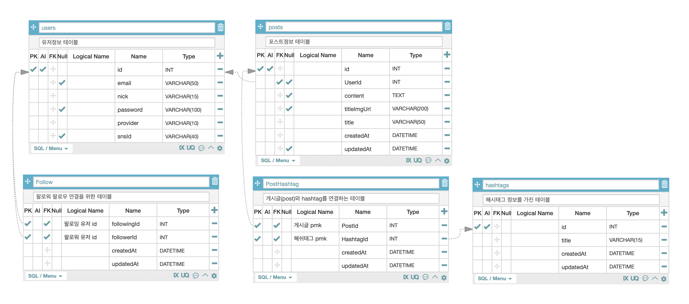

# 간단한 SNS 서비스

## SPECIFICATION

- 로컬과 카카오의 회원가입 로그인을 지원합니다. -> local done, kakao not yet
- 게시글의 생성, 수정, 삭제기능을 지원합니다.
- 댓글의 생성, 수정, 삭제기능을 지원합니다.
- 팔로잉 기능을 지원하며 팔로우와 팔로워가 존재합니다.
- 제목을 통한 검색이 가능합니다.
- 해쉬태그를 통한 검색 및 게시글에 해쉬태그를 부여할 수 있습니다.
- 추가사항
  - 유저별 페이지 및 마이페이지가 존재합니다
  - 유저별 페이지 및 마이페이지에서 해당 유저의 프로필 사진, 팔로우 팔로워 리스트를 확인할 수 있습니다.

## TECH STACK

### Front-End

- React
- Typescript
- Redux
- Redux-Saga

### Back-End

- Node.js
- javacript
- Express
- Sequelize

### DataBase

- MySQL

### ETC

- TOAST UI Editor
- AWS S3

### ERD(Entity Relationship Diagram)

